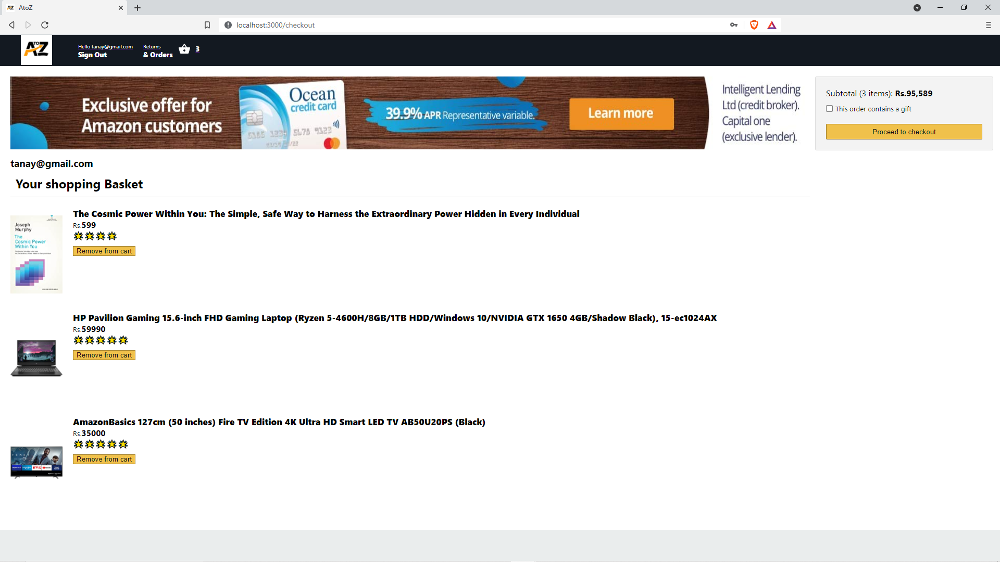
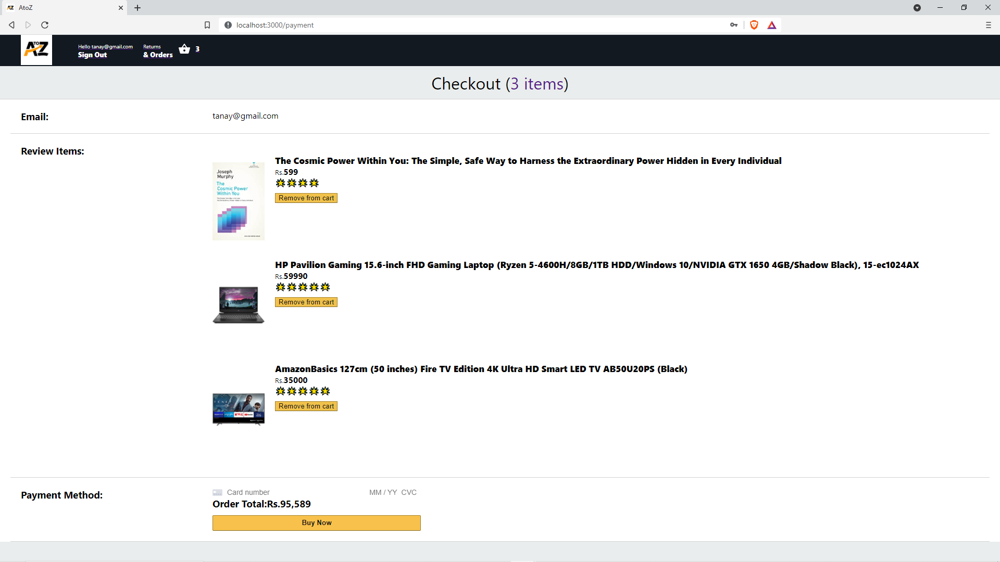
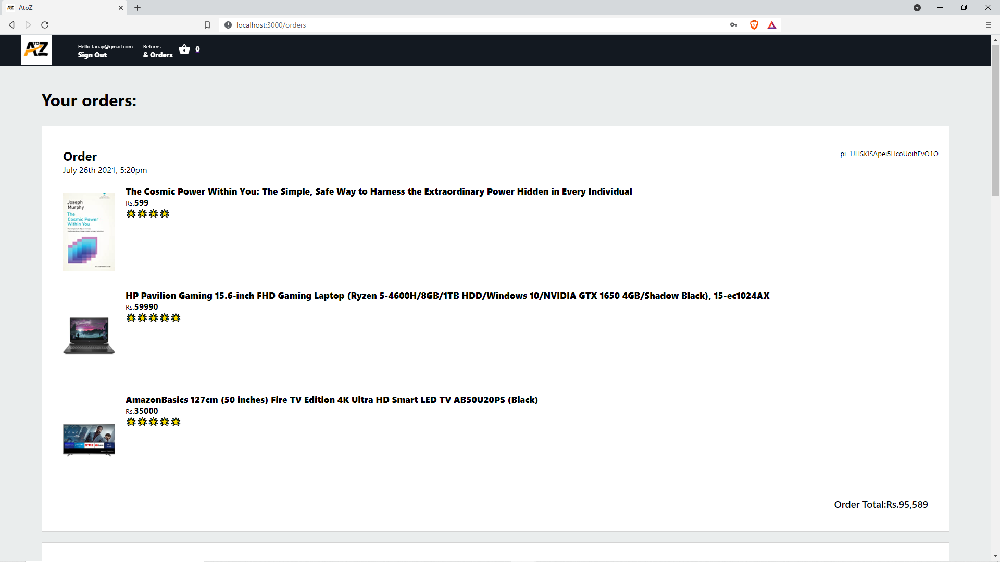

•	An e-commerce web application.

•	The consumer can select the products and add them to the cart. Then they can pay for the products and place an order.

•	Tools and Technologies Used: Stripe, Express JS,  React JS, Firebase, Visual Studio Code

Screenshots:

 
 
